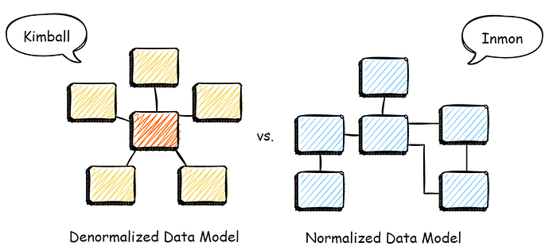

## Data Warehouse คืออะไร?

เป็นระบบที่ ๆ เรารวบรวมข้อมูลจากแหล่งต่าง ๆ และนำเอามาเก็บไว้ให้อยู่ในรูปแบบที่มีโครงสร้างเพื่อ query แล้วนำไปวิเคราะห์ และสนับสนุนการตัดสินใจต่าง ๆ ทางด้านธุรกิจ

### เป้าหมายของการใช้งาน Data Warehouse

- เพื่อความสะดวกในการทำความเข้าใจข้อมูล
- ต้องการ performance
- ใช้ข้อมูลที่มีคุณภาพ
- จัดการ และตอบคำถามทางธุรกิจต่าง ๆ
- ปลอดภัย

### Operational vs. Analytical Business Processes

#### Operational Process

จะเป็นเรื่องที่เกี่ยวกับ operation ทั้งหมด เช่น การสั่งซื้อสินค้า การส่งมอบสินค้า การเก็บข้อมูลผู้ใช้งาน ระบบที่ใช้ในการเก็บข้อมูลจะเป็นประเภท Online Transactional Processing (OLTP)

#### Analytical Process

จะเป็นเรื่องที่เราจะคอยตอบคำถามอยู่เสมอว่า "เกิดอะไรขึ้น" ในธุรกิจของเราบ้าง เช่น ประสิทธิภาพของการขายในบริษัทของเราเป็นอย่างไรบ้าง ธุรกิจของเราเติบโตแค่ไหน และจะทำให้ดีขึ้นได้อย่างไร ระบบที่ใช้ในการเก็บข้อมูลจะเป็นประเภท Online Analytical Processing (OLAP)

#### เราสามารถใช้ OLTP มาวิเคราะห์ข้อมูลได้หรือไม่?

สามารถใช้ได้ แต่

- การ query จะช้ากว่าแบบ OLAP
- ตัว schema ของข้อมูล อาจจะเข้าใจยาก ถ้ามองในมุมธุรกิจ เพราะว่า schema ต่าง ๆ ถูกออกแบบมาเพื่อรองรับการใช้งาน operational process 

#### กล่าวโดยสรุป ตัว Data Warehouse จะ

- ถูก optmize เพื่อที่จะสนับสนุนในเรื่องการวิเคราะห์ข้อมูล
- มีการรวบรวมข้อมูลจากหลาย ๆ แหล่งมาไว้รวมกัน
- เป็นระบบแบบ Online Analytical Processing (OLAP)

### Dimensional Modeling

หลัก ๆ เราจะใช้การ model ข้อมูลเป็นแบบตาราง facts และ dimensions

### Data Warehouse Architecture

#### Kimball

เค้าจะเรียกว่า Dimensional Data Warehouse จะเป็นการนำข้อมูลจาก source เอามา denormalize ก่อน หรือทำข้อมูลให้ flat ซึ่งหลาย ๆ คนน่าจะรู้จักกันในชื่อ star schema หรือ snowflake schema นั่นเอง

**ข้อดี**

- Reporting เร็ว เพราะว่าข้อมูลค่อนข้าง flat แล้ว ไม่ค่อยมีการ join กันระหว่าง table ทำให้ query เร็ว
- User friendly ด้วย โดยเฉพาะฝั่ง business เพราะว่าการมี denormalized form นั้นทำให้เราไม่ต้องมานั่งดูว่ามี tables อะไรบ้างที่มีความสัมพันธ์ต่อกัน และต้องเอามา join กันท่าไหน

**ข้อเสีย**

- เราอาจจะได้ complex ETL เพราะการที่จะ denormalize ได้ เราก็ต้องไป join กันหลาย ๆ tables และต้องคอยดูแลบำรุงรักษา ETL ของเราไปเรื่อย ๆ
- เกิด data duplication ในหลาย ๆ data marts (ในกรณีที่เราแยกออกไปทำ star หรือ snowflake schema ให้ในแต่ละ business unit) และจะเริ่มเสียความเป็น single source of truth ไป ถ้าจัดการได้ไม่ดี
- การออกแบบ ๆ Kimball นี่เป็น ongoing process ครับ เราต้องปรับไปเรื่อย ๆ ตาม business ที่เปลี่ยนแปลงไป

#### Inmon

เค้าจะเรียกกันว่า Enterprise Data Warehouse เป็นการนำข้อมูลจาก source เอามา clean ก่อน เสร็จแล้วเก็บใน data warehouse และเก็บอยู่ในรูป normalized form เวลาจะยกไปที่ data marts ตาม business unit ต่าง ๆ เราก็ยกไปเฉพาะข้อมูลที่จะใช้สำหรับ business unit นั้น ๆ หรือให้ business unit นั้น ๆ เข้าถึงข้อมูล หรือ table เฉพาะที่เค้าจะใช้งาน

**ข้อดี**

- ข้อมูล cleaned และเป็น single source of truth แน่นอนเลย ตรงนี้ใช้ storage น้อยกว่า Kimball และ less data duplication
- มี normalized data structure เลยสามารถทำ analysis แบบไหนก็ได้
- ข้อมูลต่าง ๆ ในองค์กรที่อยู่ใน data warehouse จะค่อนข้างครบ เพราะเอาเข้ามาง่าย ไม่ต้องมา denormalize ก่อน

**ข้อเสีย**

- Reporting จะช้า เพราะว่ามีการ join เยอะ เนื่องจากข้อมูลอยู่ในรูปแบบ normalized form
- เกิด isolated data marts ทำให้เวลาเราอยากจะเปรียบเทียบข้อมูลกันระหว่าง 2 business units หรือ departments จะทำได้ลำบาก หรือถ้าอยากทำจริง ๆ ก็อาจจะต้องสร้างอีก mart หนึ่งมาเพื่อเปรียบเทียบข้อมูลกัน

*สุดท้ายเราจะใช้แบบไหนดี?*

ในงานจริง ๆ เราไม่สามารถไปจะไปทางใดทางหนึ่งได้เลย โจทย์แต่ละแบบก็ต้องการวิธีแก้ปัญหาที่แตกต่างกัน สุดท้ายถ้าเราสามารถเลือกในแบบที่เราสามารถ maximize business value ได้ก็จะดีที่สุดแล้ว

### OLAP Cubes

#### Roll-Up & Drill Down

Roll-up คือการยุบ column หรือการ group by แกนใดแกนหนึ่ง เพื่อหาค่าผลรวม หรือค่าทางสถิติอื่น ๆ ส่วน Drill-down คือการที่เราแยก หรือ decompose ดูข้อมูลที่ละเอียดลงไปอีก เช่น เราอาจจะมี column ที่เป็นชื่อประเทศ แล้วเราอาจจะอยากดูข้อมูลเป็นรายจังหวัดนั่นเอง

#### Slicing & Dicing

การ Slicing คือการที่เราเลือกข้อมูล หรือ filter ข้อมูล ดึงออกมาเฉพาะข้อมูลที่เราสนใจ ยกตัวอย่างเช่น เรามีข้อมูลยอดขายเป็นรายเดือน แล้วเราอยากจะเห็นข้อมูลเฉพาะเดือน มี.ค. เราก็ filter เอาเฉพาะยอดขายของเดือน มี.ค. ออกมา ส่วน Dicing คือการที่เรา filter ข้อมูลมากกว่า 1 แกน เช่น เราอยากจะเห็นข้อมูลเฉพาะเดือน มี.ค. และ เฉพาะสาขาที่อยู่ใน กทม.
